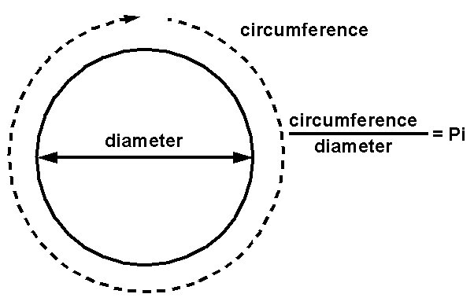
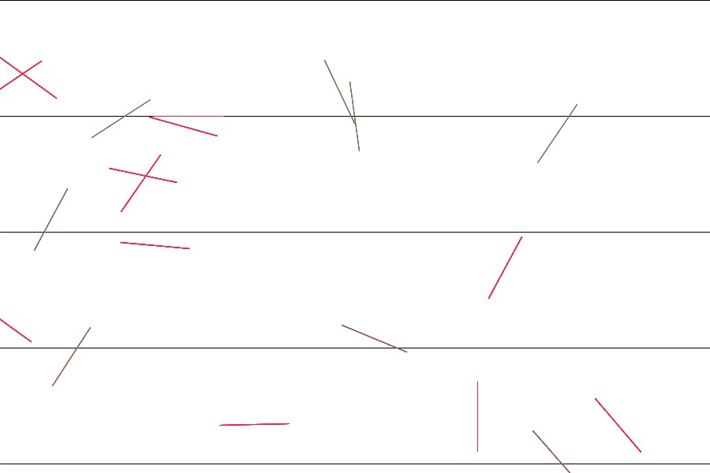
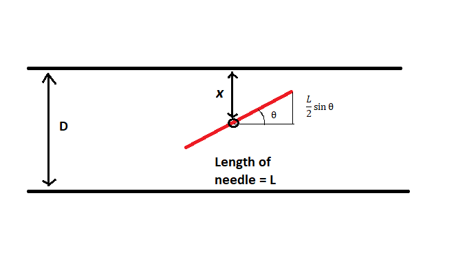
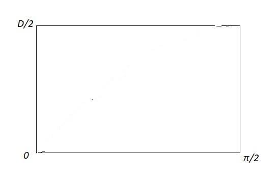
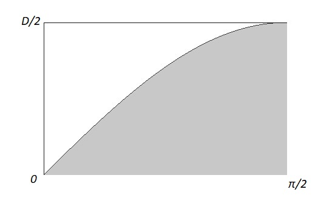

## Buffon's Needle: A really weird way to find Pi

Pi (⁡π) refers to the ratio of Circumference to diameter of any circle. It's a constant value (unless you are trying to measure ⁡π from inside the Event horizon of a Blackhole!). It's also a transcendental number which means it can't be expressed as a root of a equation with integer co-efficients. Anyways, we've been able to find value of ⁡π over 9 trillion digits after the decimal point!

<!-- <center></center><br> -->
<center></center><br>
The history of our attempt to find ⁡π goes back to Archimedes' time. He tried to calculate ⁡π using 4096 side polygon! Without any calculator, he was able to found out that value of π should lie in between 3.1429 and 3.1408.

Discovery of Calculus in the 17th century opened a new window for estimating ⁡π more precisely. Since then, we've seen plenty of methods to do it. Some of them are pretty weird but simple enough to understand. `Buffon's Needle Problem` is such one. This problem was first posed by the French Naturalist [Georges-Louis Leclerc, Comte de Buffon](https://en.wikipedia.org/wiki/Georges-Louis_Leclerc,_Comte_de_Buffon) in 1733. It goes like this:
<br>
<br>
<center>
```
Suppose you are given a floor with equally spaced parallel lines on it. If we drop a needle on the floor, what is the probability that the needle will lie across a line?
```
</center>
<br>
Let's say you've thrown `n` needles(or a single needle for `n` times or whatever). `m` number of needles crosses/intersect with a line(or `m` times if you have one needle 😛 ). The the probability _`P`_ that a needle crosses the line: <br>
<center><a href="https://www.codecogs.com/eqnedit.php?latex=P&space;=&space;m/n" target="_blank"></a></center>
 <br>

<!-- <center>  -->
<center></center><br>


</center><center>_**Buffon's Needle Problem. The green needles are the ones crossing the parallel lines**_</center>

<br>

It may seems a bit odd that how on earth ⁡π is related to this
problem. Hang on tight. I'll explain.

To solve this problem, we'll require some basic knowledge of `Probability` and `Integral Calculus`. Let's assume that the spacing between two consecutive parallel lines be _`D`_, length of needle be _`L`_. Now let the distance of the middle point of a needle on the floor to its closest line be _`x`_ and the acute angle between line and needle be `θ`(See figure above). By the way, all needles are of equal length.

<center></center>
<br>
Since we are considering _`x`_ to be the smallest distance from the center of needle to any one of the lines, it can vary only within _`0`_ and _`D/2`_. And since `θ` is an acute angle, it can take any value in between _`0`_ and _`⁡π/2`_. Using trignonometry we can easily find out that, the vertical component of the length _`L`_ is `L/2 sinθ`. The needle will cross the line if _`x`_ is greater than `L/2 sinθ`. Let me write down these two conditions before I forget them:

<br>
<center><a href="https://www.codecogs.com/eqnedit.php?latex=x<L/2sin\theta" target="_blank"></a><br>
<a href="https://www.codecogs.com/eqnedit.php?latex=0<\theta<\pi/2" target="_blank"></a> </center>

Okay. Now let's visualize possible outcomes in a graph. Let the horizontal axis be  `θ` and vertical axis be _`x`_. So a rectangle with sides `π/2` and `D/2` represents all possible outcomes in this experiment. <center></center>
<center>**Horizontal axis refers to θ and vertical axis refers to x. The rectangle represents all possible outcomes**</center>
<br>Now I am going to shade all those points in the rectangle that represents the events where a needle crosses a line according to the two conditions above. Think about it. It's just the area under the curve `D/2 sinθ` where <a href="https://www.codecogs.com/eqnedit.php?latex=0\leq\theta\leq\pi" target="_blank"></a>
<br>
<br>
<center></center>
<br><center>**The shaded area indicates the probability that a needle will cross a line**</center>
<br>Now the probability that we are looking for would be the ratio of the area under the `sine` curve and the rectangle.

Are of the rectangle:
<center><a href="https://www.codecogs.com/eqnedit.php?latex=D/2&space;*&space;\pi/2&space;=&space;\pi&space;D/4" target="_blank"></a></center><br>

Area under the `sine` curve: <br>
<center><a href="https://www.codecogs.com/eqnedit.php?latex=\int^{\pi/2}_0{L/2}\sin\theta&space;d\theta" target="_blank"></a><br><br><a href="https://www.codecogs.com/eqnedit.php?latex==&space;L/2[-cos\theta]^{\pi/2}_0" target="_blank"></a><br><br><a href="https://www.codecogs.com/eqnedit.php?latex==&space;L/2" target="_blank"></a></center>
<br>
Ratio of the second and first area _i.e.,_ Probability _`P`_ that a needle will cross a line:<br> <br>
<center><a href="https://www.codecogs.com/eqnedit.php?latex=L/2\bigg/\pi&space;D/4&space;=&space;2L\bigg/\pi&space;D" target="_blank"></a></center>

Rearranging a little, we get <br>

<center><a href="https://www.codecogs.com/eqnedit.php?latex=\pi&space;=&space;2L\bigg/P&space;D" target="_blank"></a></center>

You have the value of evey term on the right side. Just put them in the equation. You'll get <a href="https://www.codecogs.com/eqnedit.php?latex=\pi" target="_blank"></a> ! Just keep in mind, rules of probabilities tend to work fine when tested with a very large sample. Or in layman's term, you'll have to experiment with a large number of needles or throw them for a long time to get a pretty good estimation of <a href="https://www.codecogs.com/eqnedit.php?latex=\pi" target="_blank"></a>

How good this process actually is? According to [Wikipedia](https://en.wikipedia.org/wiki/Buffon%27s_needle#Estimating_%CF%80),

>In 1901, Italian mathematician Mario Lazzarini performed Buffon's needle experiment. Tossing a needle 3408 times, he obtained <a href="https://www.codecogs.com/eqnedit.php?latex=\pi" target="_blank"></a> upto six decimal points correctly.

That's insane! Lazzarini was extremely lucky to find π within only couple thousand trials. Normally it would take maybe million trials to get there. But you may get atleast two decimal ppoints correctly after a few hundred trials.

I myself created a simulation to do this experiment. You can see it below. It's throwing 'imaginary' needles to an 'imaginary' floor with parallel lines drawn on it and calculates <a href="https://www.codecogs.com/eqnedit.php?latex=\pi" target="_blank"></a>according to the formula obtained above and print on-screen. For a first few second it may say `Infinity` but don't bother. Give it some time to stabilise. You can make the throwing process faster buy pressing  `RIGHT` button if you get bored. Again if you want to slow it down, just press the `LEFT` key. 

At this point, you may ask, what is the application of this experiment in our life. The answer is `NOTHING!`. It's just a demonstration of the beauty of ⁡π. Normally you can't relate throwing needle to a plane randomly to ⁡π but as you've seen by now, they are related. When you are doing something randomly, thinking that you are the master of your own, nothing can controls you; well you are wrong! You are bounded by the rules of mathematics.

Isn't that beautiful?
